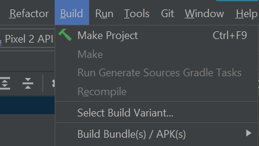
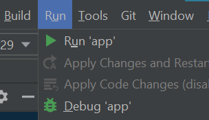

<div id="top"></div>

# LookandTell OfficialApp


<!-- PROJECT LOGO -->
<br />
<div align="center">
  <a href="https://github.com/khooinguyeen/Sign-Language-Translation/blob/main/Sign%20Language%20Translator/Demo/lookandtell.png">
    
  </a>

  <h3 align="center">Look & Tell</h3>

  <p align="center">
    An app that help translate Vietnamese sign language 
    <br />
    <a href="https://github.com/khooinguyeen/LookandTell-OfficialApp"><strong>Explore the docs »</strong></a>
    <br />
    <br />
    <a href="https://github.com/khooinguyeen/LookandTell-OfficialApp">View Demo</a>
    ·
    <a href="https://github.com/khooinguyeen/LookandTell-OfficialApp/issues">Report Bug</a>
    ·
    <a href="https://github.com/khooinguyeen/LookandTell-OfficialApp/issues">Request Feature</a>
  </p>
</div>

<details>
  <summary>Table of Contents</summary>
  <ol>
    <li>
      <a href="#about-the-project">About The Project</a>
      <ul>
        <li><a href="#built-with">Built With</a></li>
      </ul>
    </li>
    <li>
      <a href="#getting-started">Getting Started</a>
      <ul>
        <li><a href="#model">Model</a></li>
        <li><a href="#prerequisites">Prerequisites</a></li>
        <li><a href="#installation">Installation</a></li>
      </ul>
    </li>
    <li><a href="#contact">Contact</a></li>
    <li><a href="#acknowledgments">Acknowledgments</a></li>
  </ol>
</details>

## About The Project

The story begins when Kiet becomes my neighbor, he is a born deaf, ie since he was born, he has not been able to hear his mother's voice. And every day, for 10 years - until now, that child is in 5th grade, I have witnessed every day that the child struggles, has difficulty in expressing the simplest wishes of an elementary school child.

Learn about the deaf and hard of hearing, there are currently **1.5 billion** speech and hearing impaired people in the world, and **2.5 million** people in Vietnam - a huge community! However, it entails a huge economic burden for countries. According to a 2015 WHO report, the cost of speech and hearing impairment ranges from $750 to $790 billion. By 2019 it will exceed $981 billion (according to Global Burden Disease), mainly due to community and social costs - an too great economic burden for countries. * In Vietnam, the number of qualified sign language interpreters is only about **20** people, and there are no reasonable communication support products (only 1 product is produced by a student of Ho Chi Minh City University of Science and Technology but requires an additional one). equipment costs nearly 1 million VND), while conducting a survey of **250** people including deaf and hard of hearing people, it was found that nearly **100%** of people want to create a bridge to integrate and really need a product that supports communication.

With the desire to talk with Kiet (my neighbor) as well as all the deaf and hard of hearing people in the world, my friend and I decided to do this project, creating a sign language translation app

<p align="right">(<a href="#top">back to top</a>)</p>


### Built With

* [Android Studio](https://developer.android.com/)
* [Tensorflow Lite](https://www.tensorflow.org/lite)
* [Mediapipe](https://mediapipe.dev/#!)

<p align="right">(<a href="#top">back to top</a>)</p>

## Getting Started

### Model
* There are 3 models bundled in this App: hand_landmark.tflite, palm_detection.tflite, model.tflite which are located in `assets` and `ml` folder

* Visit [Sign Language Translation](https://github.com/khooinguyeen/Sign-Language-Translation) to download the model and see how we build the model 

### Prerequisites
* Android Studio 3.2 (installed on a Linux, Mac or Windows machine)
* Android device in [developer mode](https://developer.android.com/studio/debug/dev-options) with USB debugging enabled
* USB cable (to connect Android device to your computer)

### Installation

_Below is an example of how you can instruct your audience on installing and setting up your app. This template doesn't rely on any external dependencies or services._

Step 1. Clone the repo
Clone the Look & Tell GitHub repository to your computer.
   ```sh
   git clone https://github.com/khooinguyeen/LookandTell-OfficialApp
   ```

Open the Look & Tell source code in Android Studio. To do this, open Android Studio and select `Open`, setting the folder to `../LookandTell-main/LookandTell/app`


<p align="right">(<a href="#top">back to top</a>)</p>

Step 2. Build the Android Studio project
Select `Build -> Make Project` and check that the project builds successfully. You will need Android SDK configured in the settings. You'll need at least SDK version 23. The `build.gradle` file will prompt you to download any missing libraries.
  

  
Step 3. Install and run the app
Connect the Android device to the computer and be sure to approve any ADB permission prompts that appear on your phone. Select `Run -> Run app`. Select the deployment target in the connected devices to the device on which the app will be installed. This will install the app on the device.


## Contact

Email: khoinguyenmai17102005@gmail.com

Project Link: [Look & Tell App](https://github.com/khooinguyeen/LookandTell-OfficialApp)
Another project: [Sign Language Translation](https://github.com/khooinguyeen/Sign-Language-Translation)

<p align="right">(<a href="#top">back to top</a>)</p>
